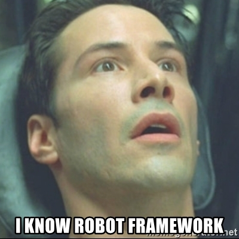

# CHILI automation coding conventions



## Content
* [1. Technical conventions](#technical-conventions)
  - [1.1 Robot Framework Tables](#robot-framework-tables)
  - [1.2 Resource Files](#resource-files)
  - [1.3 Variables](#variables)
  - [1.4 Naming Conventions](#naming-conventions)
  - [1.5 Arguments](#arguments)
  - [1.6 Inline Evaluation](#inline-evaluation)
  - [1.7 YML resource files](#yml-resource-files)
  - [1.8 Data Driven tests](#data-driven-tests)
* [2. Test / Keyword design conventions](#test-/-keyword-design-conventions)
  - [2.1 Obtain](#obtain)
  - [2.2 Test prefix](#test-prefix)
  - [2.3 Keywords documentation](#keywords-documentation)
  - [2.4 Assertion keywords prefix](#assertion-keywords-prefix)
  - [2.5 Avoid chain tests](#avoid-chain-tests)
  - [2.6 Test names and descriptions](#test-names-and-descriptions)

## Reference

Main reference goes to official Robot Framework "How to write good test cases". In case any information is missing from this paper, refer the following article:

[how to write good test cases](https://github.com/robotframework/HowToWriteGoodTestCases/blob/master/HowToWriteGoodTestCases.rst)


## Technical Conventions
---
### Robot Framework Tables

Robot framework tables (for example `*** Test Cases ***`) should be written and represented with spaces between the asterisks.

```robotframework
*** Test Cases ***
*** Variables ***
*** Settings ***
```
---
### Resource files

Files having no test cases to be executed, for example variable files, should have the builtIn `.resource` extension.

```robotframework
tests
  testCases.robot
  variables.resource
  locators.resource
```
---
### Variables

* Global variables must be uppercase
* Local variables must be lowercase

```robotframework
${GLOBAL}    variable value
${local}     variable value
```

Generally avoid declaration of global and/or suite variables.

---

### Naming conventions

It is a good practice to use `snake case` for variables:

```robotframework
${snake_case}  Do
${camelCase}   Don't
```

---

### Arguments

To avoid not knowing what parameter is passed to the function use named arguments
```robotframework
Named arguments   first=1  second=2
Positional arguments  1  2
```

On top of this be sure to always give the arguments a default value.

```robotframework
My keyword
  [Arguments]  ${test}=None  ${string}=Ciao  ${bool}=TRUE
```

---

### Inline evaluation

When keywords get too complex it is suggested to use **robotframework inline evaluation**.

```robotframework
${test}=     ${{ return str(1*3) }}
```

---

### YML resource files

To mantain a clearer code it's been decided to use YML files as our main source of variable resources.

```robotframework
*** Settings ***
Variables  my_file.yml

*** Test Cases ***
This test logs "ciao" variable from my_file.yml
  Log to console  ${ciao}
```

_Note: this type of files should just expose resources. Data-manipulation should be always done at a lower level (keyword/test level)._

---

### Data Driven tests

* Data driven tests should always be implemented when a test is executed more than twice with different data.
* Data driven tests should always use `.csv` as data-container files.

---

## Test / Keyword design conventions

---

### Obtain

use **"Obtain .."** keyword/test name when there's content and/or components to be obtained.

### Test prefix

use **Test** as a prefix for test cases
  - ```robotframework
    Test do something
    do nothing
    ```

---

### Keywords documentation

Be sure to always include `[Documentation]` in user keywords, followed by a short description of the functionality.

```robotframework
*** Keywords ***
User Keyword
  [Documentation]  Prints welcome to the given username.
  [Arguments]  ${user}=None
  Log to console  \nWelcome, ${user}!
```

---

### Assertion keywords prefix

Assertion keywords should be named with **Should ..** prefix

```robotframework
*** Keywords ***
Should be enabled
  Wait until is enabled  element
```

---

### Avoid chain tests

Chain tests should be highly avoided.

```robotframework
#Don't

Test1
  [Documentation]  This test depends on no tests

Test 2
  [Documentation]  This test depends on test 1

Test 3
  [Documentation]  This test depends on test 1 and 2

#Do

Test 1
  [Documentation]  This test depends on no tests
  step 1
  step 2
  step 3
```

---

### Test names and descriptions

Test name and descriptions should be easily understandable by everyone reading.

* Avoid naming tests with something too technical.
* Test Names should be short and comprehensible.

```robotframework
#Do
Tests login page
  step 1
  ...

#Don't
Logins with username and password then checks all elements according to specifications
  step 1
  ...
```
